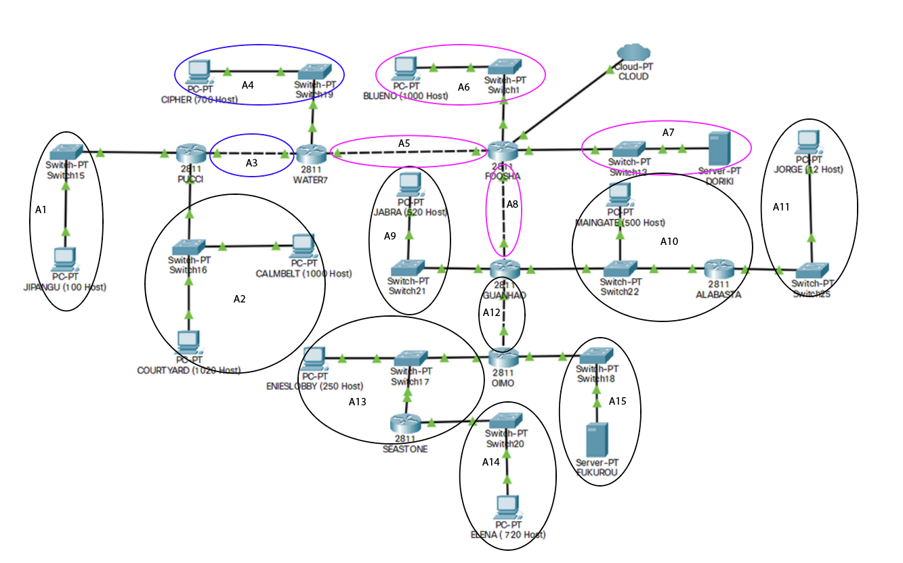
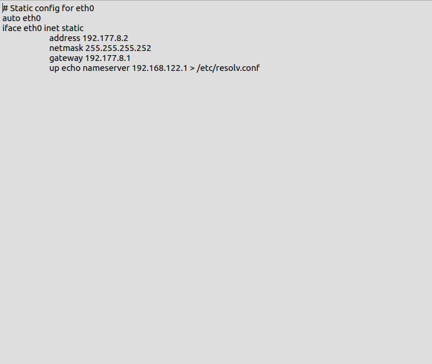

# Jarkom-Modul-4-A15-2021

Laporan Resmi 4 Modul 4 Jaringan Komputer

### Anggota Kelompok :
|NRP            |Nama        |
|:-------------:|:----------:|
|05111940000034 |Aimar Wibowo|
|05111940000064 |Ifanu Antoni|

### Nomor 1

**Catatan**

1. Deadline hari Selasa, 23 November 2021 pukul 22.00
2. Soal shiift dikerjakan pada Cisco Packet Tracer dan GNS3 menggunakan metode perhitungan CLASSLESS yang berbeda.
   Keterangan: Bila di CPT menggunakan VLSM, maka di GNS3 menggunakan CIDR atau Sebaliknya
3. Jika tidak ada pemberitahuan revisi soal dari asisten, berarti semua soal BERSIFAT BENAR dan DAPAT DIKERJAKAN.
4. Untuk di GNS3 CLOUD merupakan NAT1 jangan sampai salah agar bisa terkoneksi internet.
5. Pembagian IP menggunakan Prefix IP yang telah ditentukan pada modul pengenalan
6. Pembagian IP dan routing harus SE-EFISIEN MUNGKIN.
7. Pastikan semua NODE pada GNS3 dapat melakukan ping ke `its.ac.id`

#### Perhitungan dengan Metode VLSM

Menentukan jumlah alamat IP yang dibutuhkan oleh tiap subnet dan melakukan labeling netmask berdasarkan jumlah IP

Melakukan penggabungan dari subnet yang paling jauh hingga menjadi satu subnet penuh
Kami menggunakan bantuan `tabel` untuk melakukan penggabungan subnet

Membagi IP menggunakan pohon IP

#### Configurasi pada GNS3

Berdasarkan pohon IP yang sudah terdapat data `network ID` dan `netmask`, Pada GNS3 pada setiap network address dilakukan labelling

**Configurasi IP**
Lakukan configurasi IP dan netmask pada setiap `client` dan `router` sesuai dengan dengan **data labelling GNS3** yang ada
Pada `router` dan `client`

1.  klik kanan
2.  pilih configure
3.  pilih edit
4.  lakukan configurasi pada semua router dan client
    `router foosha`
    
    `router water7`
    
    `client fukurou`
    

**Static Routing**
Lakukan static routing pada setiap `router`

`router foosha`

`router water7`

`router pucci`

`router guanhao`

`router alabasta`

`router oimo`

`router seaston`

Lakukan iptables pada foosha `iptables -t nat -A POSTROUTING -o eth0 -j MASQUERADE`
Sekarang semua `router` dan `client` sudah terhubung dan bisa mengakses internet

## Kendala

1. Materi CIDR yang cukup sedikit
